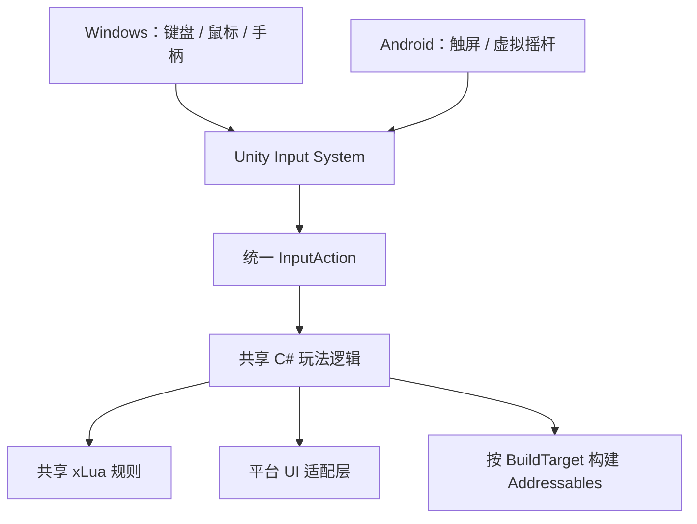

# Pixel Fantasy II

## 项目简介

`Pixel Fantasy II` 是一款基于 Unity 开发的 2D 像素风动作生存类项目，当前支持 Windows PC 与 Android。玩家在关卡中通过移动、击杀敌人、拾取经验、升级武器和释放技能来推进战斗流程。

本项目定位为学习与求职展示 Demo，重点展示核心玩法、xLua 玩法逻辑热更新、Addressables 资源热更新、JSON 本地存档、事件驱动 UI、对象池、启动热更新流程，多端适配。

## 项目特色

- 像素风角色、敌人、武器和掉落物表现。
- 武器攻击、升级、冷却、数量成长和技能释放。
- 敌人刷怪、追踪、受伤、死亡、掉落和结算流程。
- 技能解锁、分数存档、设置存档和本局运行数据管理。
- Start 场景加载条展示 Lua 更新、资源检查和资源下载进度。
- PC / Android 共用核心玩法逻辑，支持键鼠、实体手柄和移动端触屏操作；移动端 UI 与不同屏幕比例适配仍在持续完善。

## 技术亮点

- **PC / Android 输入架构**  
  采用“共享玩法逻辑 + 平台输入适配 + 平台 UI 表现”的结构。键盘、实体手柄和移动端虚拟摇杆统一接入 Unity Input System 的 `Player/Move` Action，最终复用同一个 `Player.OnMove()` 与角色移动逻辑。Android 通过 `MobileHudController` 启用虚拟摇杆、触屏技能栏和移动端暂停按钮；PC 保留原有键鼠、手柄提示和桌面分辨率设置。

- **移动端 Safe Area 基础适配（持续完善）**  
  UI 以 `1920x1080` 为设计基准，使用 Canvas Scaler、锚点和 `Screen.safeArea` 处理基础缩放与安全区域。战斗 HUD 已接入移动端布局，技能按钮继续复用原有解锁、冷却、点击事件和 Addressables 图标逻辑。由于模拟器与真机在宽高比、DPI、系统导航区域上存在差异，设置页、地图选择页及部分非常规分辨率仍在继续调整和真机验证，本项目暂不将其描述为完整的全分辨率适配方案。

- **xLua 玩法逻辑热更新**  
  C# 保留 Unity 生命周期、Inspector 引用、对象池、动画、物理和 UI，Lua 接管武器、技能、敌人、掉落、刷怪、玩家数值等可变规则。

- **Lua Zip 服务器热更新流程**  
  启动时请求 Lua manifest，对比版本后下载 zip，校验大小和 SHA256，再解压到 `persistentDataPath/LuaHotfix`。服务器不可用时回退本地 Lua。

- **Unity Editor 热更新一键构建工具**  
  基于 `EditorWindow` 和 `MenuItem` 编写热更新构建面板，将 Lua 同步、Lua Zip 与 manifest 生成、Addressables HTTP 配置、远端 Catalog 和 Bundle 构建整合为单步与一键流程；同时接入 `IPreprocessBuildWithReport`，在构建客户端前自动同步包内 Lua。

- **Addressables HTTP 资源热更新**  
  使用远端 Catalog 和 Bundle，通过本地 HTTP 服务模拟商业化资源热更新流程，支持 Sprite、VFX 和 Prefab 更新。

- **Prefab / Sprite / VFX 热更新**  
  技能图标、技能特效、武器投射物、敌人和掉落物 Prefab 可以通过 Addressables key 加载更新，失败时回退 Inspector 原引用。

- **事件驱动 UI 与运行时数据解耦**  
  使用 `GameEvents` 广播血量、经验、击杀数、分数、技能解锁和任务进度变化，使用 `RunData` 管理本局击杀数和生存时间，减少 UI 每帧轮询。

- **有限状态机（FSM）**
  使用统一的 `IState` 接口管理玩家和敌人的 `Idle`、`Move`、`Attack`、`Hurt`、`Die` 等状态，通过 `OnEnter`、`OnUpdate`、`OnFixedUpdate`、`OnExit` 约束状态生命周期，并由 `TransitionState` 负责安全切换。敌人状态同时支持 C# 默认实现与 `LuaState` 热更新实现，在不修改状态机调用层的情况下替换 AI 状态规则。

- **EnemyManager 空间分区寻敌系统**
  使用“敌人注册表 + 固定网格空间分区”统一管理寻敌。敌人从对象池启用时注册、回收时注销，空间网格在首次查询时按帧懒重建，同一帧内的多次寻敌共用查询数据。范围寻敌只扫描目标附近的网格，并使用距离平方筛选最近目标，减少大量敌人场景下的全列表遍历；同时统一过滤死亡、禁用或已经回收的敌人。武器和 Lua 规则继续通过 `GetNearestEnemy`、`GetNearestEnemyInRange`、`GetRandomEnemy` 等稳定接口获取目标。

- **输入设备状态管理**  
  使用`InputController`来进行玩家输入的控制，记录上一次有效输入设备，技能按钮可自动切换键鼠/手柄图标。

- **对象池优化**  
  敌人、掉落物、伤害数字等高频对象通过对象池复用，并与 EnemyManager、掉落逻辑和 Addressables Prefab 替换流程配合。

- **DOTween UI 动画表现**  
  使用 DOTween 实现血条平滑变化和伤害数字弹出动画，让受伤反馈更直观，同时减少手写协程和插值逻辑。

- **JSON 本地数据存储**  
  使用 `Newtonsoft.Json` 保存设置、分数和技能解锁状态，逐步替代旧 PlayerPrefs 数据。

- **多语言切换**  
  接入 `Localization`，通过语言下拉框切换 `LocalizationSettings.SelectedLocale`，并将语言选择保存到 `settings.json`，重启后自动恢复用户上次选择的语言。

## 多端适配架构



多端实现分工：

```text
Unity Input System       统一键盘、手柄与虚拟摇杆输入
InputController          记录当前设备类型，管理鼠标、EventSystem 焦点和输入提示
MobileHudController      启用 Android 专属 HUD、重排技能按钮并应用战斗 Safe Area
MobileSafeAreaLayout     提供 Safe Area 和界面缩放入口，设置页与地图选择页仍在持续调试
Player / SkillController PC 与 Android 共享角色移动、技能、冷却和解锁逻辑
xLua                     跨平台共享可热更玩法规则
Addressables             资源 key 跨平台统一，Bundle 按 BuildTarget 分别构建
```

当前实现的是多平台客户端适配，不包含账号系统、云存档或 PC 与手机之间的实时存档同步。`settings.json` 和 `save_data.json` 会保存在各设备自己的 `Application.persistentDataPath` 中。

## 使用的插件、官方包与 Unity 系统

### 第三方插件

- **xLua**：实现 C# Host 与 Lua Rule 分层、玩法规则加载、模块重载以及 Lua Zip 服务器热更新。
- **DOTween**：实现血条平滑过渡、伤害数字缩放与位移动画，并通过 Tween 回调管理伤害数字的对象池回收。

### Unity 官方包

- **Input System**：统一接收键鼠、实体手柄和移动端 `OnScreenStick` 输入，并根据当前设备切换 UI 图标、鼠标状态与 EventSystem 焦点。
- **Addressables**：通过远端 Catalog、Bundle 和资源 key 加载可更新的 Sprite、VFX、武器、敌人及掉落物 Prefab。
- **Localization**：管理技能、武器、设置界面等文本的多语言切换，并通过文本变化事件刷新当前 UI。
- **Newtonsoft.Json for Unity**：序列化本地设置、总分和技能解锁进度，并处理文件缺失、字段缺失和 JSON 损坏回退。
- **Unity UI（UGUI）**：构建菜单、技能按钮、血条、经验条、加载进度条及 EventSystem 导航交互。

### Unity 内置系统

- **Animator / Animation State Machine**：控制玩家、敌人、武器和界面动画，并与角色状态机及场景切换流程配合。
- **Rigidbody2D / Collider2D**：处理玩家与敌人移动、武器命中、接触伤害和拾取物触发。
- **Tilemap**：生成并维护战斗地图格子，根据玩家位置清理超出渲染范围的 Tile。
- **AudioMixer**：管理主音量、音乐和音效通道，并将用户设置保存到 `settings.json`。
- **Particle System**：负责技能和武器的粒子表现，并作为 Addressables 可更新特效资源的一部分。


## 热更新系统

当前启动流程：

```text
start
  -> 检查 Lua Zip 热更新
  -> 初始化 xLua
  -> 检查 Addressables Catalog
  -> 下载 gameplay 资源
  -> 进入 title
```

热更新分工：

```text
C#             Unity 生命周期、资源加载、对象池、UI、物理、动画
Lua            玩法规则、数值成长、武器逻辑、敌人规则、掉落规则、伤害修正
Addressables   Prefab、Sprite、VFX、资源引用
JSON           本地设置、分数、技能解锁状态
GameEvents     血量、经验、击杀数、任务、技能解锁等 UI 通知
RunData        当前局击杀数、生存时间等运行时数据
```

## 项目结构

```text
Assets/
  Lua/                         Lua 配置与玩法规则源码
  Scripts/
    Hotfix/                    xLua 热更新基础设施与 C# Host
    Controller/                游戏流程、UI、设置、存档、启动加载
    DamageSystem.cs            统一伤害系统
    GameEvents.cs              事件中心
    RunData.cs                 当前局运行时数据
    EnemyManager.cs            敌人注册表、网格空间分区与统一寻敌服务
    PlayerRuntimeRegistry.cs   当前玩家运行时注册表
    ObjPool/                   对象池
    Weapon/                    武器表现与控制器
    PickUp/                    掉落物逻辑
  Scenes/
    start.unity                启动加载场景
    title.unity                标题与主菜单场景
    level1*.unity              关卡场景
  StreamingAssets/
    Lua/                       包内默认 Lua 文件
  AddressableAssetsData/       Addressables 配置

AddressablesRemote/            本地资源热更新输出目录示例
Packages/                      Unity Package 配置
ProjectSettings/               Unity 项目设置
```

## 运行环境

- Unity `2022.3.55f1`
- Visual Studio 2022
- Windows / Android
- xLua
- Addressables
- Newtonsoft.Json
- DOTween
- Unity Input System
- Unity Localization


## 本地热更新测试

本项目使用本地 HTTP 服务器模拟远端热更新服务器。

服务器根目录：

```text
D:\AddressablesServerRoot
```

Addressables 资源测试地址示例：

```text
http://127.0.0.1:18080/AddressablesRemote/StandaloneWindows64/catalog_1.0.hash
```

Lua 热更新 manifest 地址示例：

```text
http://127.0.0.1:18080/LuaRemote/lua_manifest.json
```

